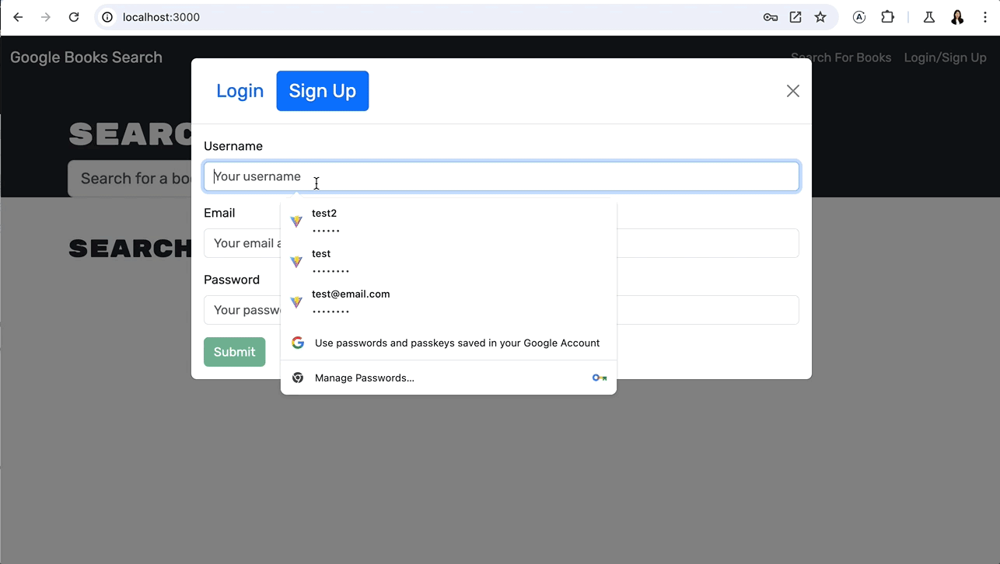

#  Book Search Engine

# About
This is a MERN stack application built with GraphQL API using Apollo server. It allows a user to search for a book title or author. It is a fully responsive application that adapts to any viewport. 

# Deployed Link
https://book-search-engine-pdk3.onrender.com/

# Screenshot
The user can signup, search and save books as shown in the gif below:

The user can delete a book, log out, log in as show in the gif below:

# Installation
Run the following commands in your terminal:

`npm i`

`npm run develop`
